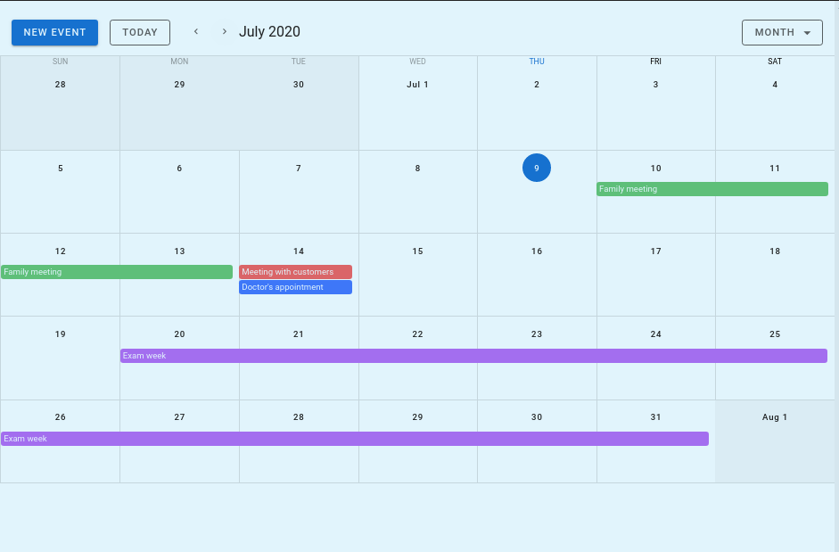
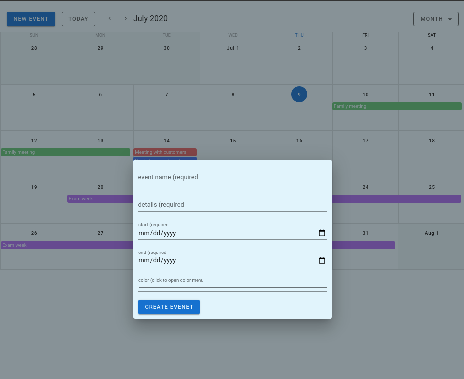
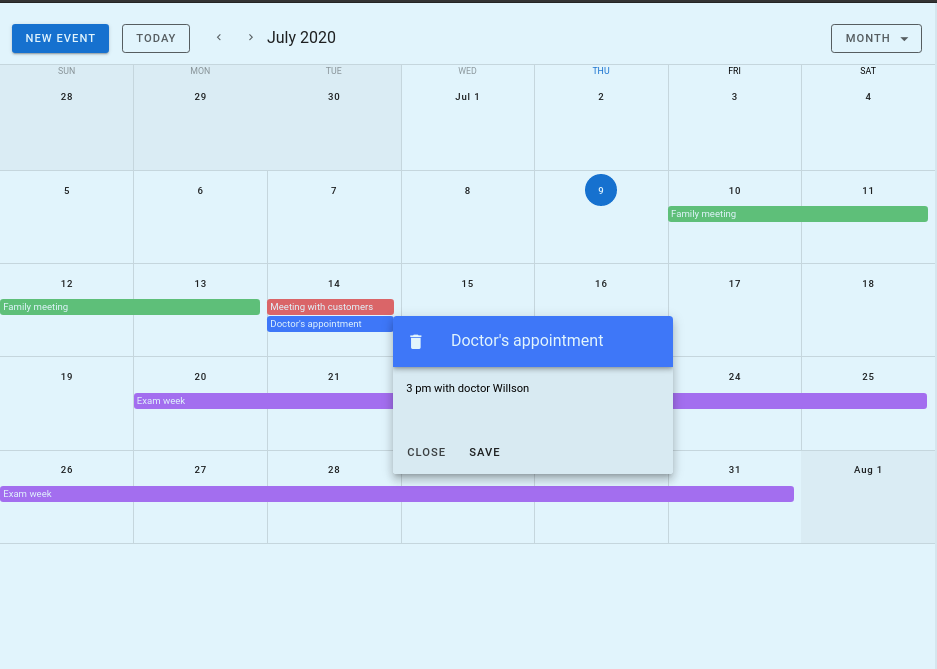

# Vue + Vuetify Calendar with CRUD actions.

[![Contributors][contributors-shield]][contributors-url]
[![Forks][forks-shield]][forks-url]
[![Stargazers][stars-shield]][stars-url]
[![Issues][issues-shield]][issues-url]

> This calendar is a CRUD app implementation from the Vuetify 'Events Calendar'. I also implemented the dialog component for better user experience when dealing with event editing and creation. Finally, for the backend/DB management, I am using Firebase with async requests for fetching and posting data.







## Built With

### Developing tools

- Vue
- Vuetify
- JavaScript
- Firebase
- Github

## Project setup

```
npm install
```

### Compiles and hot-reloads for development

```
npm run serve
```

### Compiles and minifies for production

```
npm run build
```

### Lints and fixes files

```
npm run lint
```

### Customize configuration

See [Configuration Reference](https://cli.vuejs.org/config/).

### Prerequisites

- Node. If you do not have Node installed in your local machine, please refer to the [Official Documentation](https://nodejs.org/en/download/)
- Vue. If you don't have it installed, please refer to the [Official Documentation.](https://vuejs.org/)
- Basic command line knowledge.

## Author

👤 **Luis Angel Maldonado**

- Github: [@lmaldonadoch](https://github.com/lmaldonadoch)
- Twitter: [@LuisAngelMCh](https://twitter.com/LuisAngelMCh)
- LinkedIn: [lmaldonadoch](https://www.linkedin.com/in/lmaldonadoch)

## Future Upgrades

- Google calendar sync.
- Live version.

## 🤝 Contributing

Feel free to check the [issues page](https://github.com/lmaldonadoch/shooter-game/issues).

## Show your support

Give a ⭐️ if you like this project!

<!-- MARKDOWN LINKS & IMAGES -->

[contributors-shield]: https://img.shields.io/github/contributors/lmaldonadoch/calendar.svg?style=flat-square
[contributors-url]: https://github.com/lmaldonadoch/calendar/graphs/contributors
[forks-shield]: https://img.shields.io/github/forks/lmaldonadoch/calendar.svg?style=flat-square
[forks-url]: https://github.com/lmaldonadoch/calendar/network/members
[stars-shield]: https://img.shields.io/github/stars/lmaldonadoch/calendar.svg?style=flat-square
[stars-url]: https://github.com/lmaldonadoch/calendar/stargazers
[issues-shield]: https://img.shields.io/github/issues/lmaldonadoch/calendar.svg?style=flat-square
[issues-url]: https://github.com/lmaldonadoch/calendar/issues
